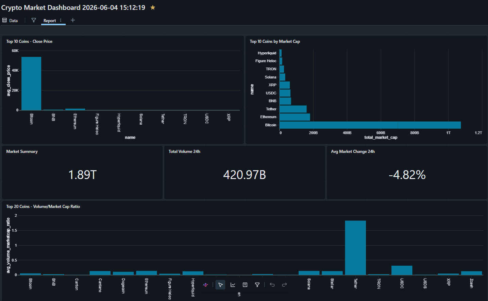
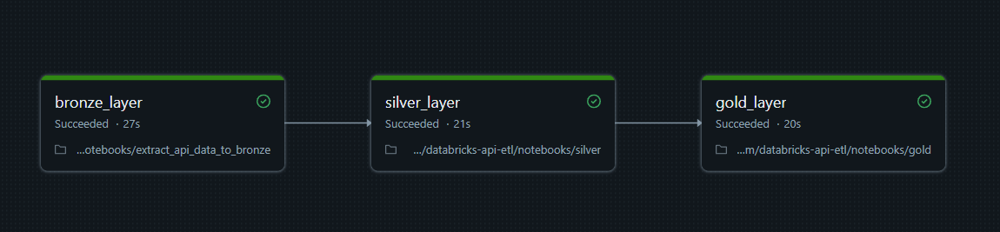
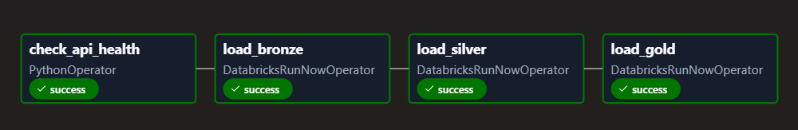

# Crypto Market ETL Pipeline (Databricks Lakehouse)

## Overview

This project implements an **end-to-end ETL pipeline** that ingests cryptocurrency market data from the public CoinGecko API and processes it using **Databricks and PySpark**.

The pipeline follows the **Medallion Architecture (Bronze → Silver → Gold)** to transform raw API data into analytics-ready datasets stored in **Delta Lake tables**.

The goal of the project is to demonstrate **data engineering practices such as API ingestion, data cleaning, transformation, and analytical modeling** in a modern lakehouse environment.

---

## Architecture

```
CoinGecko API
      ↓
  Apache Airflow (Daily Schedule)
      ↓
┌─────────────────────────────────────────────┐
│           Medallion Architecture            │
│                                             │
│  Bronze → Silver (SCD Type 2) → Gold        │
│                                             │
│         Databricks + Delta Lake             │
└─────────────────────────────────────────────┘
      ↓
  Databricks AI/BI Dashboard
```

---
## Medallion Data Layers

### Bronze — Raw Ingestion
- Fetches top 100 coins from CoinGecko `/coins/markets` endpoint
- Stores raw JSON payload as-is with metadata columns (`_ingested_at`, `ingestion_date`, `_source`)
- Append-only — full historical record preserved
- Partition by `ingestion_date` for efficient reads
- Data quality assertions before write (nulls)

### Silver — Cleaned & Historical
- Parses and typed raw JSON into structured columns
- Computes `_row_hash` (MD5) for change detection
- Implements **SCD Type 2** with `valid_from`, `valid_to`, `is_current` columns
- Incremental load: only changed or new coins trigger a MERGE

### Gold — Business Aggregations
- **`daily_prices`** — OHLCV metrics per coin per day
- **`gld_market_rankings`** — Market cap rankings snapshot
- **`tbl_market`** — Total market cap, 24h volume, avg price change
- **`tbl_liquidity`** — Volume/market cap ratio per coin - How actively a coin is traded
- Data quality assertions before write (nulls, negative prices)
- Overwrite mode — always reflects latest state, ready for BI consumption

---

## Key Concepts

- **Medallion Architecture** — Bronze / Silver / Gold separation of concerns
- **SCD Type 2** — Full price history with valid_from / valid_to / is_current
- **Incremental Load** — MD5 row hashing for efficient change detection
- **Data Quality Checks** — Assertion-based checks at each layer before write
- **Partition Pruning** — Daily partitions on Bronze for optimized Silver reads
- **Idempotency** — Pipeline can safely re-run without duplicating data

---

## Technologies Used

| Technology | Purpose                  |
| ---------- | ------------------------ |
| Databricks | Data processing platform |
| PySpark    | Data transformations     |
| Delta Lake | Storage format           |
| Python     | API ingestion            |
| Apache Airflow | Orchestration        |
| SQL-Databricks AI/BI Dashboard        | Analytical queries       |

---

## Project Structure
```
databricks-api-etl/
│
├── notebooks
|   ├── init (create Unity Catalog resources)
│   ├── extract_api_data_to_bronze_layer
│   ├── silver
│   ├── gold
│
|── airflow
|   ├── crypto_pipeline_dag.py
|
├── etl_pipeline.png
│  
│── crypto_pipeline-graph.png
│── dashboard.png
│
└── README.md
```
---

## Unity Catalog

```
catalog:  crypto
├── bronze
│   └── brz_crypto
├── silver
│   └── slv_crypto
└── gold
    ├── daily_prices
    ├── market_rankings
    ├── tbl_market_summary
    ├── tbl_liquidity
    └── tbl_top_crypto
```

---

## SCD Type 2 — How It Works

Every time a coin's price, market cap, volume or rank changes, the pipeline:
1. **Closes** the existing record (`is_current = False`, `valid_to = today`)
2. **Inserts** a new record (`is_current = True`, `valid_to = 9999-12-31`)

This preserves the full price history for every coin across all pipeline runs.

```
| coin_id | price  | valid_from | valid_to   | is_current |
|---------|--------|------------|------------|------------|
| bitcoin | 67420  | 2026-06-01 | 2026-06-02 | false      |
| bitcoin | 68100  | 2026-06-02 | 9999-12-31 | true       |
```

---

## Dashboard

<!-- Replace with your actual screenshot -->


Built with Databricks AI/BI Dashboard on top of the Gold layer tables:
- **Top 10 coins by market cap** (bar chart)
- **24h price change** (positive/negative bar chart)
- **Volume/Market Cap ratio** — liquidity view
- **Market summary KPIs** — total market cap, 24h volume, avg change

---

## Pipeline Workflow

- Fetches and store raw data from API
- SCD Type 2 processing and transformation
- Build analytical business-ready datasets in Gold tables

#### Databricks Job

---
#### Airflow 

---


---

## Author

Data Engineering portfolio project built to demonstrate modern lakehouse data pipeline development using Databricks.